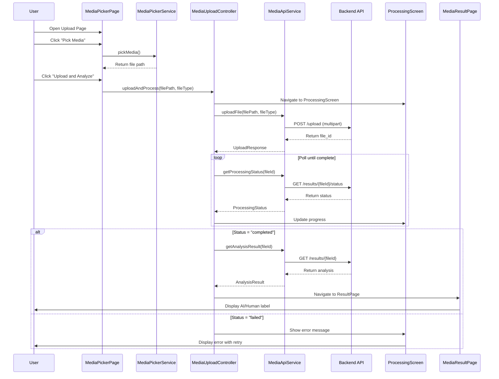
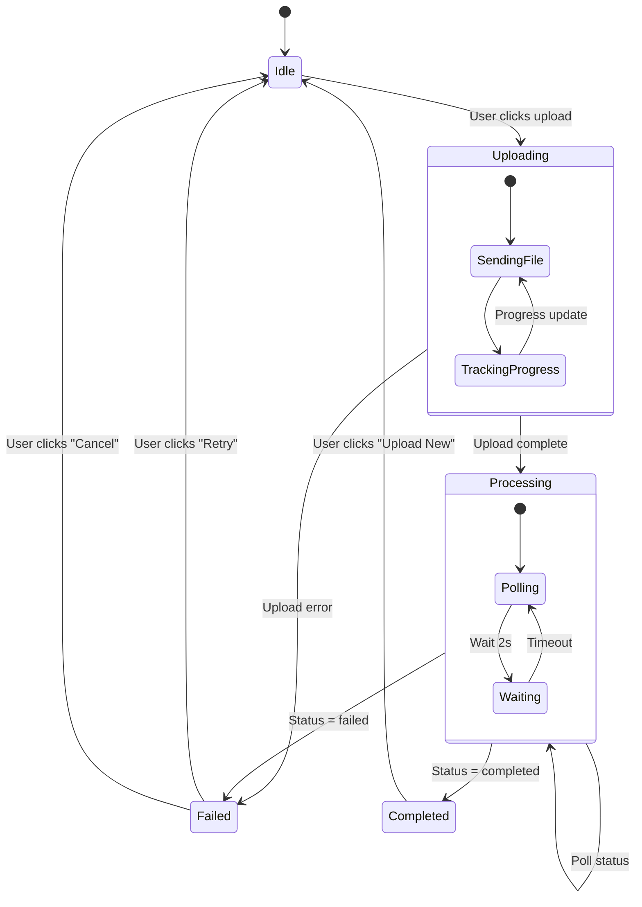
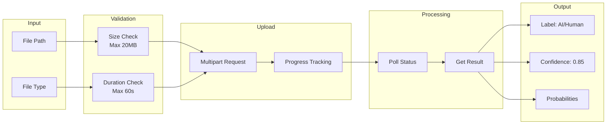
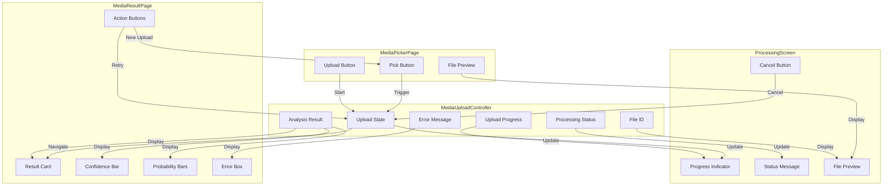
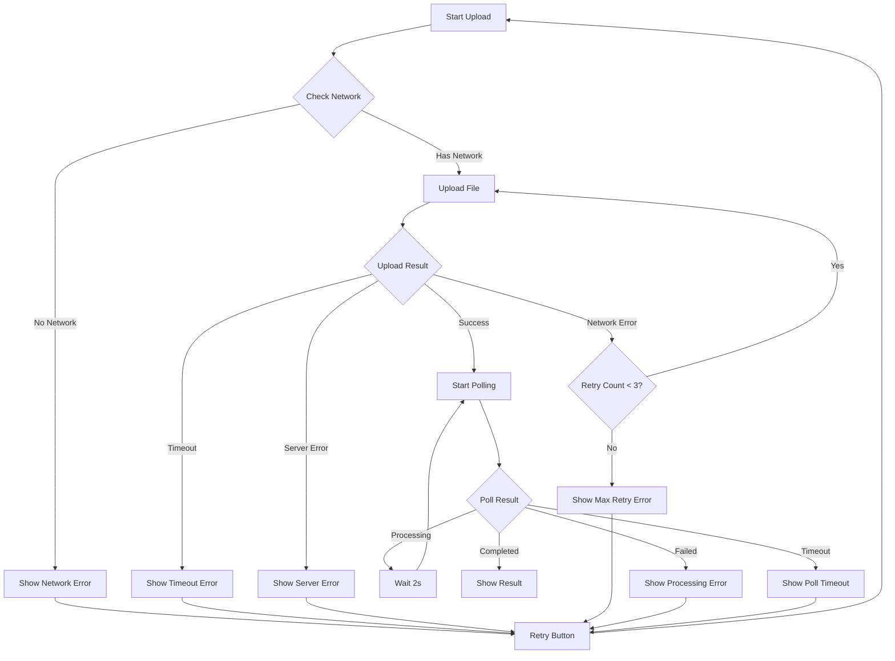

# Media Upload and Result Retrieval - Architecture Diagrams

## System Architecture Overview

```mermaid
graph TB
    subgraph "UI Layer"
        MP[MediaPickerPage]
        PS[ProcessingScreen]
        MR[MediaResultPage]
    end
    
    subgraph "State Management"
        MUC[MediaUploadController]
    end
    
    subgraph "Services"
        MPS[MediaPickerService]
        MAS[MediaApiService]
    end
    
    subgraph "Models"
        UR[UploadResponse]
        PS_M[ProcessingStatus]
        AR[AnalysisResult]
    end
    
    subgraph "Backend API"
        UP[POST /upload]
        ST[GET /results/{id}/status]
        RES[GET /results/{id}]
    end
    
    MP -->|Pick file| MPS
    MP -->|Upload| MUC
    MUC -->|Upload file| MAS
    MAS -->|Multipart request| UP
    UP -->|Return file_id| MAS
    MAS -->|Poll status| ST
    ST -->|Return status| MAS
    MAS -->|Get result| RES
    RES -->|Return analysis| MAS
    MAS -->|Update state| MUC
    MUC -->|Navigate| PS
    MUC -->|Navigate| MR
    PS -->|Show progress| MUC
    MR -->|Display result| MUC
    
    style MP fill:#e1f5ff
    style PS fill:#fff4e1
    style MR fill:#e8f5e9
    style MUC fill:#f3e5f5
    style MPS fill:#fce4ec
    style MAS fill:#e0f2f1
```

## User Flow Diagram



## State Management Flow



## Data Flow Diagram



## Component Interaction Diagram



## Error Handling Flow



## API Communication Flow

```mermaid
graph LR
    subgraph "Flutter App"
        MAS[MediaApiService]
    end
    
    subgraph "FastAPI Backend"
        UP[Upload Endpoint]
        ST[Status Endpoint]
        RES[Result Endpoint]
    end
    
    MAS -->|1. POST /upload<br/>Content-Type: multipart/form-data<br/>Body: file| UP
    UP -->|2. Response<br/>{file_id: 'abc123'}| MAS
    
    MAS -->|3. GET /results/abc123/status| ST
    ST -->|4. Response<br/>{status: 'processing'}| MAS
    
    MAS -->|5. GET /results/abc123/status| ST
    ST -->|6. Response<br/>{status: 'completed'}| MAS
    
    MAS -->|7. GET /results/abc123| RES
    RES -->|8. Response<br/>{label: 'AI', confidence: 0.85}| MAS
```

## File Structure Diagram

```
lib/
├── models/
│   ├── upload_response.dart          ← Upload response model
│   ├── processing_status.dart        ← Processing status model
│   └── analysis_result.dart          ← Analysis result model
│
├── services/
│   ├── media_picker_service.dart     ← Existing (no changes)
│   └── media_api_service.dart        ← NEW: API communication
│
├── controllers/
│   └── media_upload_controller.dart  ← NEW: State management
│
├── pages/
│   ├── MediaPickerPage.dart          ← UPDATE: Add upload button
│   ├── ProcessingScreen.dart         ← NEW: Show progress
│   └── MediaResultPage.dart          ← UPDATE: Show results
│
└── widgets/
    └── result_card_widget.dart       ← NEW: Result display widget
```

## Key Features Summary

| Feature | Description | Status |
|---------|-------------|--------|
| File Picking | Select image/video from gallery | ✅ Existing |
| File Validation | Check size (20MB) and duration (60s) | ✅ Existing |
| Upload Progress | Show upload percentage | 🆕 New |
| Status Polling | Check processing status every 2s | 🆕 New |
| Result Display | Show AI/Human label with confidence | 🆕 New |
| Error Handling | Network errors, timeouts, retries | 🆕 New |
| Retry Mechanism | Retry failed uploads | 🆕 New |
| Timeout Handling | 5-minute timeout for processing | 🆕 New |

## State Transitions

```
Idle → Uploading → Processing → Completed
  ↓         ↓           ↓          ↓
Failed    Failed      Failed    Show Result
  ↓         ↓           ↓          ↓
Retry     Retry       Retry    Upload New
```
